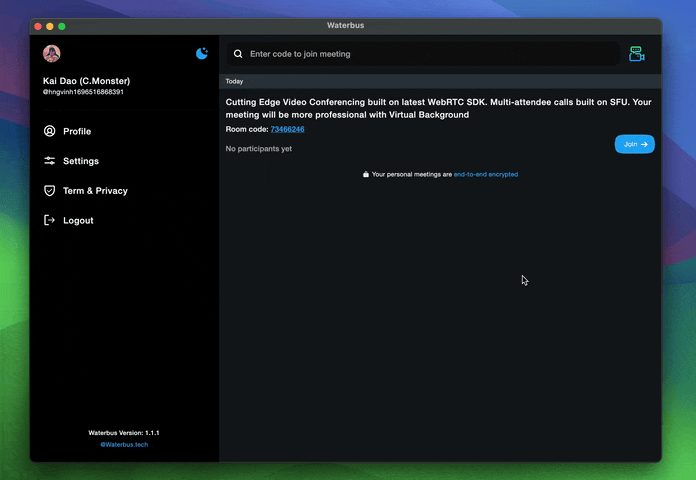
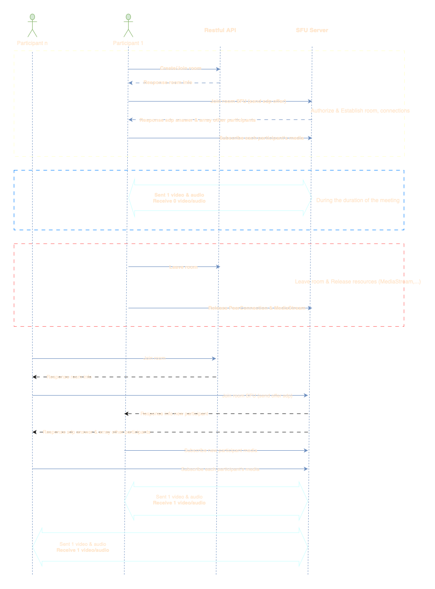
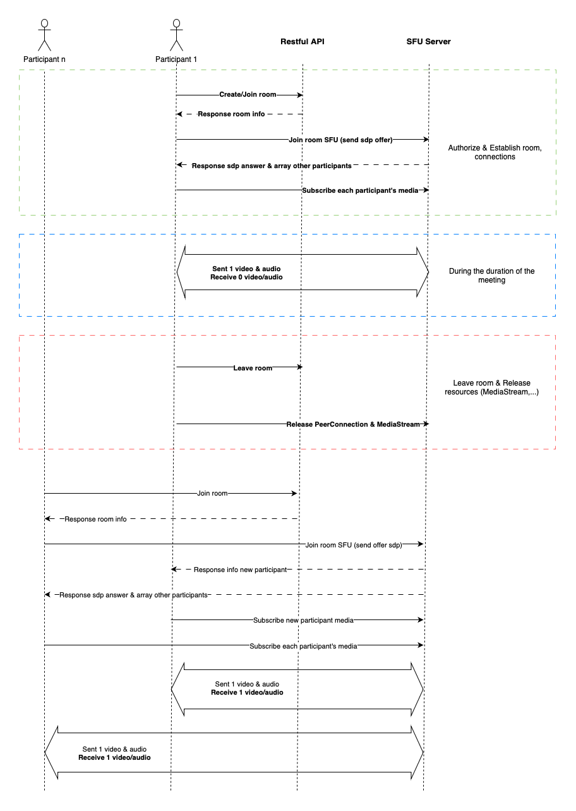
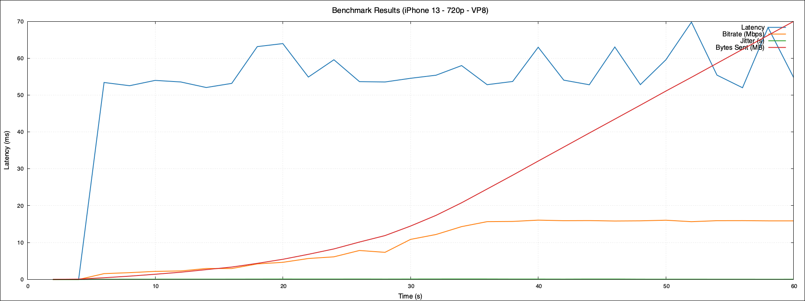
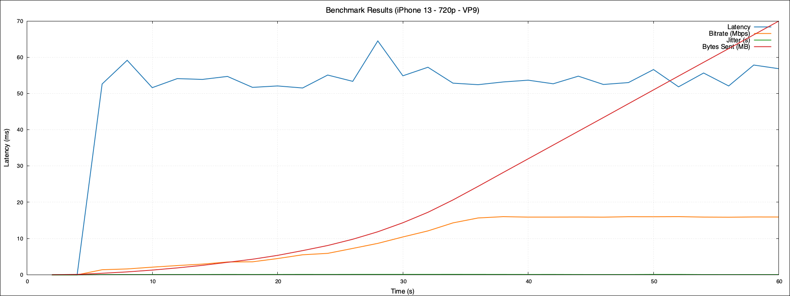
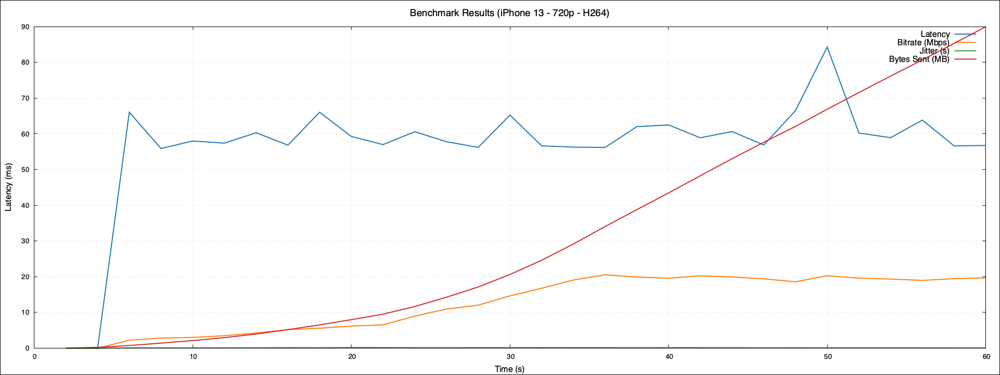
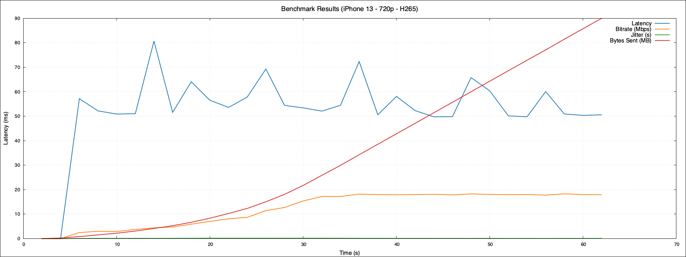
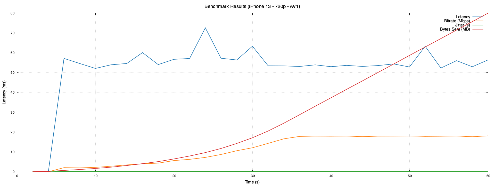

<p align="center">
  
</p>

<div class="badges" align="center">
<p><a href="https://codecov.io/gh/lambiengcode/waterbus"></a><a href="https://www.codefactor.io/repository/github/lambiengcode/waterbus"></a><a href="https://chromium.googlesource.com/external/webrtc/+/branch-heads/6099"></a><a href="https://github.com/lambiengcode"></a></p>
</div>
<div align="center">
<a href="https://twitter.com/waterbustech"></a><a href="https://discord.gg/mfrWVefU"></a>
</div>
<p align="center">
  <a href="https://docs.waterbus.tech">Website</a> &bull;
  <a href="https://github.com/lambiengcode/waterbus/wiki">Wiki</a> &bull;
  <a href="https://github.com/lambiengcode/waterbus/blob/main/LICENSE">License</a>
</p>



## 🌤️ About

🤙 This is an Open Source Video Conferencing App that utilizes Flutter and WebRTC technologies to provide users with a platform to conduct virtual meetings, conferences, and webinars. The app is built to provide seamless audio and video communication, as well as screen sharing, chat functionality, and file sharing.

## ✨ Why is this so awesome?

* 👥 **Multiple Participants**: `Waterbus` enables high-quality group video calls using `WebRTC SFU`.
* 💻 **Screen Sharing**: Share your screen with the participants of your call.
* 🎥 **Video Codec Support**: Supports a wide range of video codecs including `AV1`, `H.264`, `H.265`, `VP8`, and `VP9`.
* 🌌 **Virtual Background**: Enhance your meetings with professional virtual backgrounds.
* 🖼️ **Picture-in-Picture**: Increase productivity with picture-in-picture multitasking.
* 🔒 **End-to-End Encryption**: Ensure secure meetings with end-to-end encryption.
* 💋 **Beauty Filter**: Using [GPUPixel](https://github.com/pixpark/gpupixel) to implement Beauty Filters

## 🎯 Goal

My project isn't intended to replace standard video conferencing platforms like `Google Meet`. Instead, it focuses on facilitating code sharing. I've noticed that features such as `Virtual Background` or `Picture in Picture` aren't widely implemented in existing solutions, and there's a lack of reference code for them. Many developers resort to third-party solutions for video calls but often miss out on these features. My goal is to provide a reference project that includes these functionalities, offering developers a starting point for integrating them into their own products.

If you have suggestions or problems, please [open an issue](https://github.com/lambiengcode/waterbus/issues) or contribute directly 🤓

<h3 align="center">👉 The Virtual Background feature supports on Android, iOS and MacOS</h3>
<br/>
<div align="center">
<p><a href="https://youtube.com/shorts/Ms4avix05uY"></a>
<a href="https://youtube.com/shorts/PDIDbVoHT5o"></a>
<a href="https://youtu.be/VIIxOZJlmj4"></a></p>
</div>

## ⚡ Current supported features

| Feature            | Subscribe/Publish | Screen Sharing | Picture in Picture | Virtual Background | Beauty Filters | End to End Encryption |
| ------------------ | ----------------- | -------------- | ------------------ | ------------------ | -------------- | --------------------- |
| Android            |         🟢         |        🟢      |          🟢         |          🟢         |       🟡        |           🟢          | 
| iOS                |         🟢         |        🟢      |          🟢         |          🟢         |       🟢       |           🟢          |  
| MacOS              |         🟢         |        🟢      |          🔴         |          🟢         |       🟢       |           🟢          |      
| Web                |         🟢         |        🟢      |          🟡         |          🟡         |       🟡       |           🟢          |    


🟢 = Available

🟡 = Coming soon (Work in progress)

🔴 = Not currently available (Possibly in the future)

> [!NOTE]  
> - `AV1` supported on iOS 14 and above, Android 14 and above.
> - `E2EE` only supported `H264`, `VP8` and `VP9`
> - `Video codec Android supported`: Check at [Google Site](https://developer.android.com/guide/topics/media/platform/supported-formats#video-codecs)

<details>
<summary> 🖼️ Online Meeting Diagram</summary>

[](https://docs.waterbus.tech#gh-dark-mode-only)
[](https://docs.waterbus.tech#gh-light-mode-only)

</details>

## 🚀 Getting Started

To compile `Waterbus` from the source code, follow these steps:

1. Install [Flutter](https://flutter.dev).
2. Clone the Waterbus repository.
4. Run `flutter pub get` to download dependencies.
5. Run `flutter run` to start the app.

## 🛠️ Building

These commands are intended for maintainers only.

### Android

Set keystore if you use jks in this repo, or create your own

```bash
export KEY_WATERBUS_PASSWORD=banhcuon
export ALIAS_WATERBUS_PASSWORD=banhcuon
```

Traditional APK

```bash
flutter build apk
```

AppBundle for Google Play

```bash
flutter build appbundle
```

### iOS

Pod install

```bash
cd ios
bash clean-pods.sh
```

```bash
flutter build ipa
```

### macOS

Pod install

```bash
cd macos
bash clean-pods.sh
```

```bash
flutter build macos
```

### Web

```bash
flutter build web
```

## 🔥 Usage

1. Sign up for an account
2. Create a new meeting
3. Share the meeting link with other participants
4. Start the meeting and utilize the available features

## 🛠 Selfhosted Waterbus

- [Waterbus Server API](https://github.com/waterbustech/waterbus-restful-service)
- [Waterbus Server WebSocket & SFU](https://github.com/waterbustech/waterbus-sfu-meeting)
- [Waterbus Documents](https://docs.waterbus.tech)

## ⏲️ Benchmarking

- This part is benchmarking video codecs within a 60-second duration of an online meeting on an iPhone 13 running iOS 17.0.2. The codecs included in the benchmark are VP8, VP9, H.264, H.265, and AV1.
- The benchmark aims to quickly compare the performance differences between these codecs during a short online meeting session.

#### 📱 Device Specifications

- **Model:** iPhone 13
- **Operating System:** iOS 17.0.2

#### 🌟 Results

You can view the benchmark results in the generated plots and data files. Here's how you can interpret the results:

<details>
  <summary>VP8</summary>
  - Total encode time: 9325 (µs) in 60s call

  <picture>
    <source width="100%" alt="lambiengcode" media="(prefers-color-scheme: dark)" srcset="./benchmark/vp8-benchmark-plot.png">
    
  </picture>
</details>
<details>
  <summary>VP9</summary>
  - Total encode time: 12091 (µs) in 60s call
  
  <picture>
    <source width="100%" alt="lambiengcode" media="(prefers-color-scheme: dark)" srcset="./benchmark/vp9-benchmark-plot.png">
    
  </picture>
</details>
<details>
  <summary>H264</summary>
  - Total encode time: 11127 (µs) in 60s call
  
  <picture>
    <source width="100%" alt="lambiengcode" media="(prefers-color-scheme: dark)" srcset="./benchmark/h264-benchmark-plot.png">
    
  </picture>
</details>
<details>
  <summary>H265</summary>
  - Total encode time: 9264 (µs) in 60s call
  
  <picture>
    <source width="100%" alt="lambiengcode" media="(prefers-color-scheme: dark)" srcset="./benchmark/h265-benchmark-plot.png">
    
  </picture>
</details>
<details>
  <summary>AV1</summary>
  - Total encode time: 13615 (µs) in 60s call
  
  <picture>
    <source width="100%" alt="lambiengcode" media="(prefers-color-scheme: dark)" srcset="./benchmark/av1-benchmark-plot.png">
    
  </picture>
</details>

## 💙 Supports

Support it by joining [stargazers](https://github.com/lambiengcode/waterbus/stargazers) for this repository. ⭐

Also, follow [maintainers](https://github.com/lambiengcode) on GitHub for our next creations!

[](https://star-history.com/#lambiengcode/waterbus&Date#gh-dark-mode-only)
[](https://star-history.com/#lambiengcode/waterbus&Date#gh-light-mode-only)

[](https://github.com/lambiengcode/waterbus/stargazers/#lambiengcode/waterbus&Date#gh-dark-mode-only)
[](https://github.com/lambiengcode/waterbus/stargazers/#gh-light-mode-only)

## 🤝 Contributing

Contributions are welcome! Please feel free to submit a pull request or open an issue if you encounter any problems or have suggestions for improvements.

## 📧 Contact Information

If you have any questions or suggestions related to this application, please contact me via email: `lambiengcode@gmail.com`.

