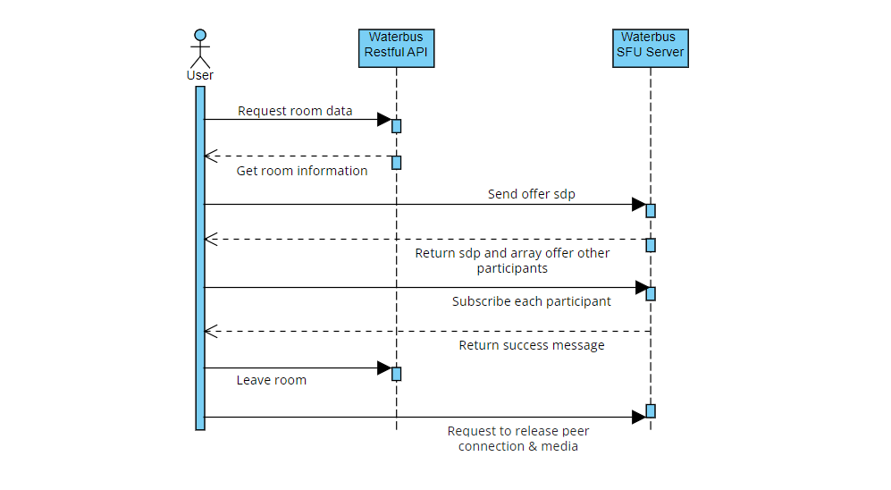

[](https://codecov.io/gh/lambiengcode/waterbus)[](https://twitter.com/lambiengcode)[](https://github.com/lambiengcode)


# Waterbus: Online Meeting App using Flutter and WebRTC SFU (Selective Forwarding Unit)

<p align="justify">

This is an Online Meeting App that utilizes Flutter and WebRTC technologies to provide users with a platform to conduct virtual meetings, conferences, and webinars. The app is built to provide seamless audio and video communication, as well as screen sharing, chat functionality, and file sharing.

The Waterbus concept has been used for physical transportation, but it can also be applied to online meeting platforms. A virtual Waterbus platform would allow users to travel along a virtual route and stop at designated locations to attend meetings. The platform could also incorporate gamification elements for increased engagement. This approach provides a unique and fun way for remote teams to collaborate while acknowledging the trend of using waterways for transportation.
</p>

## Screenshots
<p>


</p>

## Online Meeting Diagram


## Meeting Features

| Feature | Android | iOS |
| :-------------: | :-------------:| :-----: |
| Audio/Video | :heavy_check_mark: | :heavy_check_mark: |
| Screen Sharing | [WIP] | [WIP] |  
| Picture in Picture | [WIP] | [WIP] | 
| Virtual Background | [WIP] | [WIP] | 
| Recorder | [WIP] | [WIP] | 

## Directiory Structure

```
waterbus/
├── packages/
│   ├── auth/
│   │   ├── lib/
│   │   ├── test/
│   │   └── pubspec.yaml
│   ├── schedule/
│   │   ├── lib/
│   │   ├── test/
│   │   └── pubspec.yaml
│   ├── settings/
│   │   ├── lib/
│   │   ├── test/
│   │   └── pubspec.yaml
│   └── meeting/
│       ├── lib/
│       ├── test/
│       └── pubspec.yaml
├── lib/
│   ├── main.dart
│   ├── screens/
│   ├── widgets/
│   ├── services/
│   └── utils/
│   └── bloc/
├── assets/
├── test/
├── android/
├── ios/
├── pubspec.yaml
└── README.md

```

## Requirements

Flutter
WebRTC
Firebase
Android Studio / Xcode

## Installation

1. Clone the repository git clone https://github.com/lambiengcode/waterbus-webrtc-mobile-app.git
2. Run `flutter pub get` to install dependencies
3. Run the app using `flutter run`

## Configuration

Create a Firebase project and add the necessary configuration files to the project
Set up a WebRTC server for video and audio communication
Update the app configuration file with the necessary information

## Usage

1. Sign up for an account
2. Create a new meeting
3. Share the meeting link with other participants
4. Start the meeting and utilize the available features

## Star History

[](https://star-history.com/#lambiengcode/waterbus&Date)

## Contributing
Contributions are welcome! Please feel free to submit a pull request or open an issue if you encounter any problems or have suggestions for improvements.

## Contact Information

If you have any questions or suggestions related to this application, please contact me via email: `lambiengcode@waterbus.tech`.

## License

```terminal
MIT License

Copyright (c) 2023 lambiengcode

Permission is hereby granted, free of charge, to any person obtaining a copy
of this software and associated documentation files (the "Software"), to deal
in the Software without restriction, including without limitation the rights
to use, copy, modify, merge, publish, distribute, sublicense, and/or sell
copies of the Software, and to permit persons to whom the Software is
furnished to do so, subject to the following conditions:

The above copyright notice and this permission notice shall be included in all
copies or substantial portions of the Software.

THE SOFTWARE IS PROVIDED "AS IS", WITHOUT WARRANTY OF ANY KIND, EXPRESS OR
IMPLIED, INCLUDING BUT NOT LIMITED TO THE WARRANTIES OF MERCHANTABILITY,
FITNESS FOR A PARTICULAR PURPOSE AND NONINFRINGEMENT. IN NO EVENT SHALL THE
AUTHORS OR COPYRIGHT HOLDERS BE LIABLE FOR ANY CLAIM, DAMAGES OR OTHER
LIABILITY, WHETHER IN AN ACTION OF CONTRACT, TORT OR OTHERWISE, ARISING FROM,
OUT OF OR IN CONNECTION WITH THE SOFTWARE OR THE USE OR OTHER DEALINGS IN THE
SOFTWARE.
```

## Keywords

Online Meeting, Flutter, WebRTC, Audio Communication, Video Communication, Screen Sharing, Chat Functionality, File Sharing, Firebase, Virtual Meetings, Conferences, Webinars.
